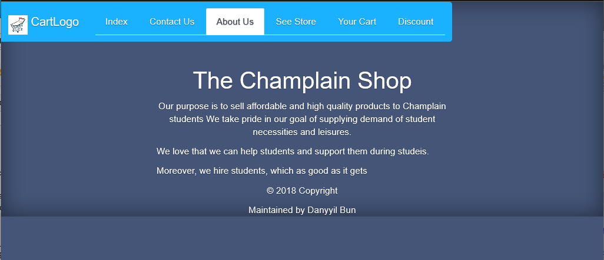
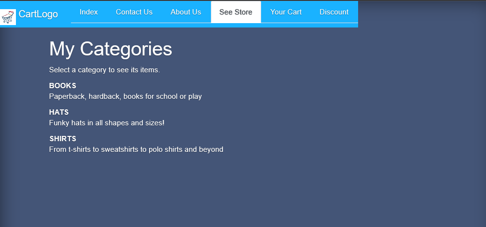

<head>
		<title>  Danyyil Bun Portfolio</title>
    <link rel="stylesheet" type="text/css" href="OldVersion/bootstrap-4.0.0/css/bootstrap.min.css"/>	
</head>
<body>
	<ul class = "nav nav-tabs justify-content-end" role="tablist">
	<li class="nav-item"><a class="navbar-brand" href="index.md">
	
		Main Page
		</a></li>
		 <li class="nav-item">	  
		<a class=" nav-link " href = "education.md">Education</a>
		</li>  
		  <li class="nav-item active">  
		<a class="active nav-link" href = "projects.md">Projects</a>
		</li>
		  <li class="nav-item">
		<a class=" nav-link" href = "resume.md">Resume</a>
		</li>
    	<li class="nav-item">
		<a class="  nav-link" href = "contactInfo.md">Contact Info</a>
		</li>
		</ul>
		</nav>
		<main>

<h1>My Projects</h1>    

        <h1>Pictures of webiste</h1>  
        
          
                  
          
    

</main>
</body>